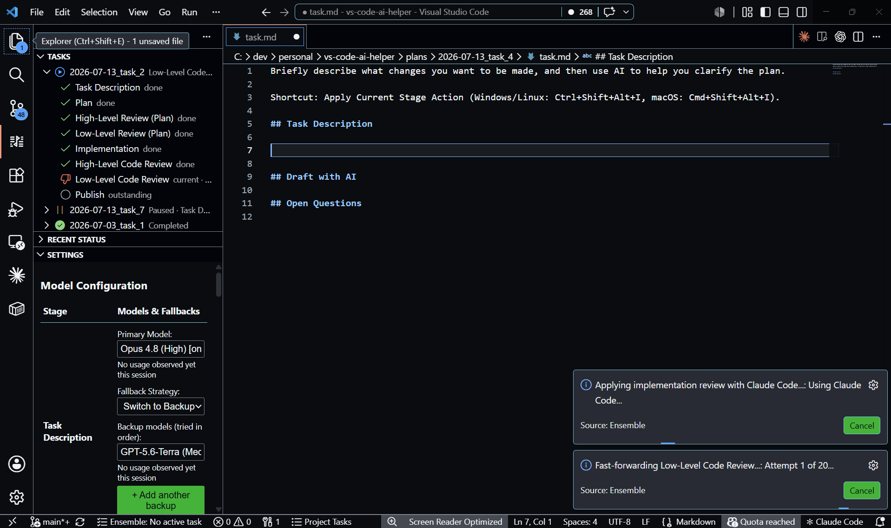
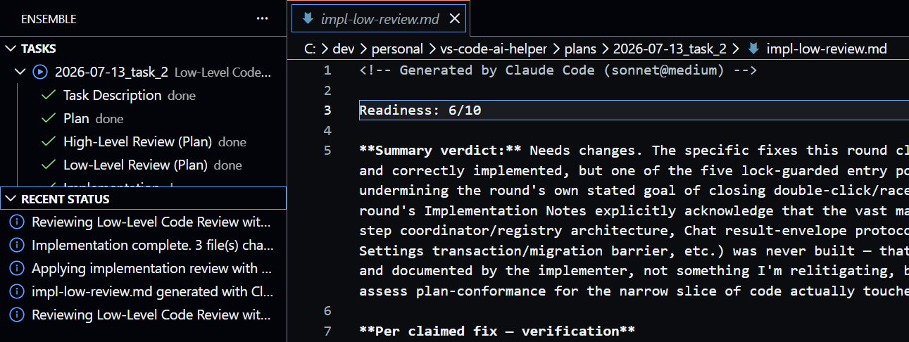
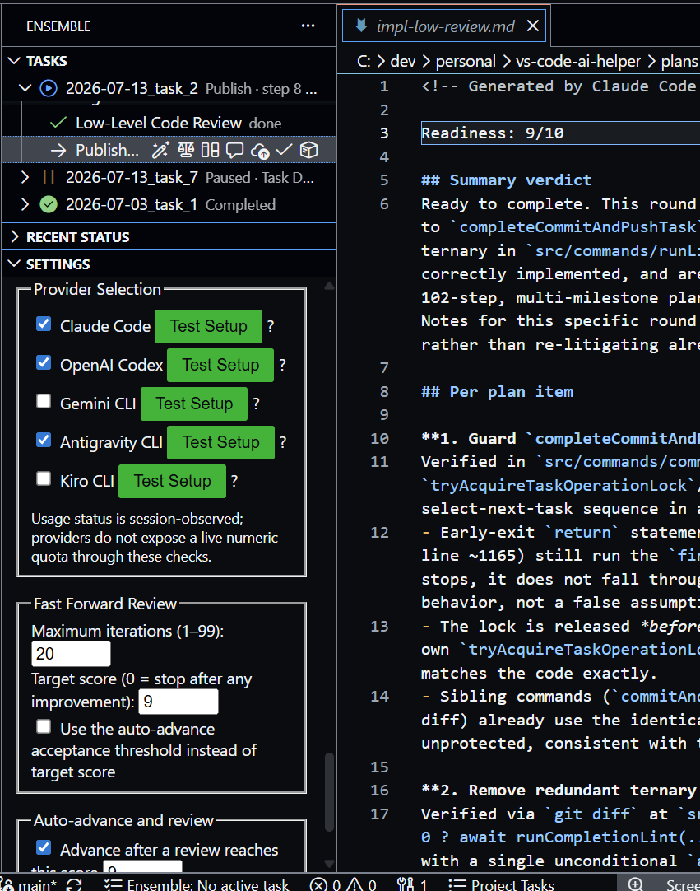
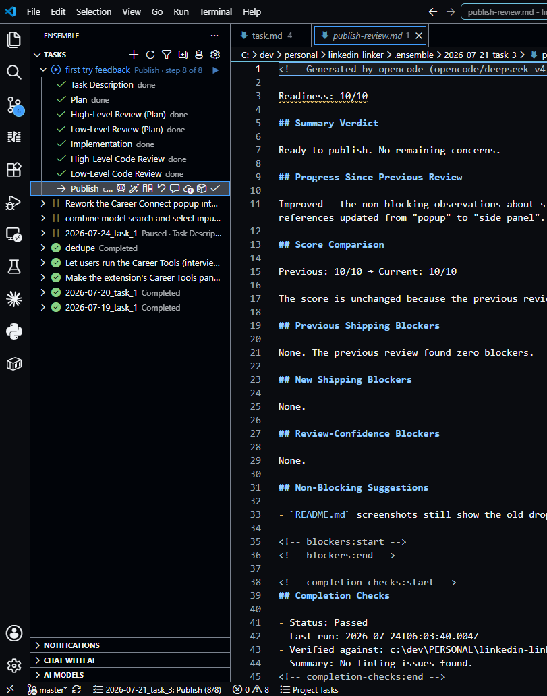

# Ensemble

Ensemble is an agentic workflow system for VS Code. It turns an idea into a supervised, reviewable implementation: capture the task, shape a plan, implement it with the AI provider you choose, and review the result before moving on.

## The workflow

The task → plan → implementation → review → publish loop keeps human judgment in the driver’s seat:

1. **Task:** describe the goal, scope, constraints, and acceptance criteria in `task.md`. Write it yourself or generate a first draft with **Draft with AI**.
2. **Plan:** draft or edit `plan.md`, then run the **high-level** and **low-level** plan reviews to improve it. Each review scores the plan's readiness and lists blockers; apply the fixes and re-review until it holds up.
3. **Implementation:** the implementation stage works from the plan (captured in `plan-final.md`) and carries out the changes. AI implementation runs edit workspace files, so supervise and inspect every change — then the **high-level** and **low-level** code reviews check the result the same way the plan reviews checked the plan.
4. **Publish:** run lint, tests, and any configured verification checks, inspect the accumulated diff, and finish the task — commit and push, cut a release, or mark it complete.

The Tasks view and status bar show the current task and stage. Every AI action has a manual counterpart, and task artifacts remain ordinary Markdown and JSON files that you can edit, inspect, or use with another tool.

### Optional: hands-off iteration

Reviews score each stage out of 10, and Ensemble can drive the loop for you. **Fast Forward** repeatedly reviews and applies fixes until it reaches a target score, and **Auto Advance** moves a stage on once its review clears a threshold. Both are off by default and configurable in Ensemble's settings; because implementation and Fast Forward runs change real files, use them only under supervision.

## Screenshots









## Requirements

**Minimum: VS Code 1.93+ and GitHub Copilot.** Copilot uses the GitHub account VS Code is already signed into, so there is nothing extra to install and it is enabled by default. Copilot's free tier is enough to try Ensemble; sustained use will run into its limits and need a paid Copilot plan.

That is the whole requirement. Everything below is optional.

### Optional: vendor CLI providers

Ensemble can also drive vendor CLIs that authenticate against your existing subscription, so you can use a different model for each workflow step. Every CLI provider is **off by default** — enable the ones you want under **Ensemble: Configure AI Models**. None of them is required.

| Provider | Install | Account |
|---|---|---|
| **Gemini CLI** | `npm i -g @google/gemini-cli`, then run `gemini` once | Google account; free tier available |
| **Claude Code** | `npm i -g @anthropic-ai/claude-code`, then run `claude` once | Claude Pro or Max subscription |
| **Codex CLI** | `npm i -g @openai/codex`, then `codex login` | ChatGPT Plus or Pro subscription |
| **Antigravity** | Install the Antigravity CLI, then run `agy` once | Google account |
| **Kiro CLI** | Install from [kiro.dev/cli](https://kiro.dev/cli/) | Kiro login **and** a `KIRO_API_KEY` environment variable — `kiro-cli login` alone is not sufficient for headless runs |
| **OpenCode Zen / Go** | `npm i -g opencode-ai`, then run `opencode` and use `/connect` | Zen and Go share an OpenCode account/API key, but are separate services: Zen needs its own billing and Go needs an active Go subscription |
| **Cline CLI** | `npm i -g cline`, then `cline auth cline-pass` | [ClinePass](https://docs.cline.bot/getting-started/clinepass) subscription ($9.99/mo) — a curated open-weights model catalog (DeepSeek, GLM, Kimi, MiniMax, MiMo, Qwen) |
| **Kimi Code CLI** | Official installer only — `irm https://code.kimi.com/kimi-code/install.ps1 \| iex` (Windows) or `curl -fsSL https://code.kimi.com/kimi-code/install.sh \| bash` (macOS/Linux), then `kimi login`. Do **not** install via `npm i -g @moonshot-ai/kimi-code` — see the note below. | Moonshot AI / Kimi Code account (OAuth device-code sign-in) |
| **devpass-code** | Install devpass-code, then `devpass-code providers login` | LLM Gateway DevPass credential — a single account fronting a large model catalog (Claude, GPT, Gemini, GLM, Grok, DeepSeek, Qwen, Kimi, and more) |

OpenCode appears as two separate provider rows in Ensemble: **OpenCode Zen** for `opencode/...` models and **OpenCode Go** for `opencode-go/...` models. They use the same `opencode` CLI and can use the same OpenCode key, but enabling or connecting one does not grant access to the other. Choose the tier explicitly; a Zen/Go backup is only used when you explicitly select it as a backup model.

devpass-code is a separate CLI that happens to be a rebrand/fork of OpenCode: it shares the same `--agent plan`/`--agent build` read-only/edit distinction (see the Antigravity/Cline/Kimi notes below for how that compares to other providers), but fronts its own single "LLM Gateway DevPass" account rather than OpenCode's Zen/Go split, so it appears as one plain provider row.

> **Note on Antigravity:** it runs with `--dangerously-skip-permissions` in **every** mode, including plan and review — so it can create, change, or delete any file in your workspace without asking, even on a run you'd expect to be read-only. The other providers restrict their read-only stages (Claude `--permission-mode plan`, Codex `--sandbox read-only`, Kiro `--trust-tools fs_read,grep,glob`, opencode `--agent plan`); Antigravity's headless CLI offers no equivalent, and without the flag its runs fail having done nothing. Commit or back up before using it, or pick another provider.

> **Note on Cline:** like Antigravity, its headless CLI has no scoped read-only mode. Text-mode runs (plan/review) do pass `--plan`, but that only changes the model's own system-prompt instructions — its shell-command tool stays available and auto-approved regardless, so a plan/review run can still create, change, or delete files if a prompt causes it to do so (verified directly: an instructed shell command created a file even with `--plan` set). Edit-mode runs use `--auto-approve true` explicitly. Disabling auto-approval isn't a safer alternative either — it blocks every tool, including plain file reads, since headless mode has no way to grant interactive approval. Commit or back up before using it, or pick another provider.

> **Note on Kimi Code CLI:** its headless CLI has no scoped read-only mode either, and it's worse than Antigravity's/Cline's — `-p` (its one-shot prompt flag) rejects `--plan`, `--yolo`, AND `--auto` outright (verified live: the CLI errors on each combination), so **no mode passes any permission flag at all**; implementation and plan/review runs use identical arguments. Verified directly that a bare invocation with zero flags still wrote a file and ran a shell command with no approval prompt. Also note: its CLI accepts a prompt only as a command-line argument (no stdin, and no prompt-file flag), which caps argv at the OS command-line limit. Ensemble works around that by writing the full prompt to a temp file and passing Kimi a short instruction to read it — Kimi's own file tools then pull the content in, so large context packs work normally (verified against a 419 KB file, including content at its end). One consequence remains: Kimi must be installed via the **official installer**, not npm, because that transport requires launching the real binary rather than the shell-shim wrapper an npm install produces. Commit or back up before using it, or pick another provider.

### Choosing models and effort tiers per stage

A model's **effort tier** (Low/High/Max, etc.) predicts review quality far more than which model you pick — the same model at two effort tiers has produced opposite verdicts on the same code, including a wrong 10/10 at a low tier that missed a blocker an equivalent high-tier run caught. Some general guidance drawn from observed runs:

- **Never run Publish below a high effort tier.** The specific model matters far less than the tier at this stage.
- **Never assign a free or daily-limited model to Implementation.** A quota exhaustion mid-implementation can leave a broken, half-written tree.
- **Prefer Claude Code or Codex CLI for Implementation.** Implementation runs are long, stateful, and write files, so a provider that fails safely (leaving the tree consistent on a quota stop) matters more there than anywhere else.
- **Treat OpenCode as acceptable for reviews** (short, read-only, cheap to redo) but be cautious using it for Implementation, where an interruption is more costly.
- **Cross provider boundaries in your backup chain.** If a stage's backup is on the same account as its primary (Ensemble warns about this in **Configure AI Models** when Fallback Strategy is set to Switch to Backup), a session limit or quota outage on the primary will hit the backup identically — order backups so at least one crosses to a different provider account.

AI actions consume real quota or money, and implementation runs modify workspace files.

## Quick start

1. Install from the [Visual Studio Marketplace](https://marketplace.visualstudio.com/items?itemName=j2kenton.vs-code-ai-helper).
2. Open a workspace folder. Ensemble stores task metadata in `.ensemble` at the workspace root. If you have tasks from an older version in a different folder, run **Ensemble: Move Ensemble Resources to .ensemble** to migrate them.
3. Run **Ensemble: Start New Task**, describe the work in `task.md`, and use **Generate Plan** or write the plan yourself.
4. Run the plan reviews, implement, run the code reviews, then use the Publish stage to verify, commit, and complete the task.

Configure models per workflow step under **Ensemble: Configure AI Models**.

## Safety and disclaimer

This extension is provided as-is with no warranty. Read [`DISCLAIMER.md`](DISCLAIMER.md) in full before use. AI runs send eligible open-editor contents to the selected third-party provider and may create, overwrite, or delete workspace files. Always commit or back up first, supervise every run, and review generated changes. See [`SECURITY.md`](SECURITY.md) for vulnerability reporting.

## Development

```bash
pnpm install
pnpm run compile
pnpm run test:unit
```

Press `F5` to launch an Extension Development Host. Run `pnpm run lint` for linting and `pnpm run package` to build a VSIX.

## License

MIT — see [LICENSE](LICENSE).
