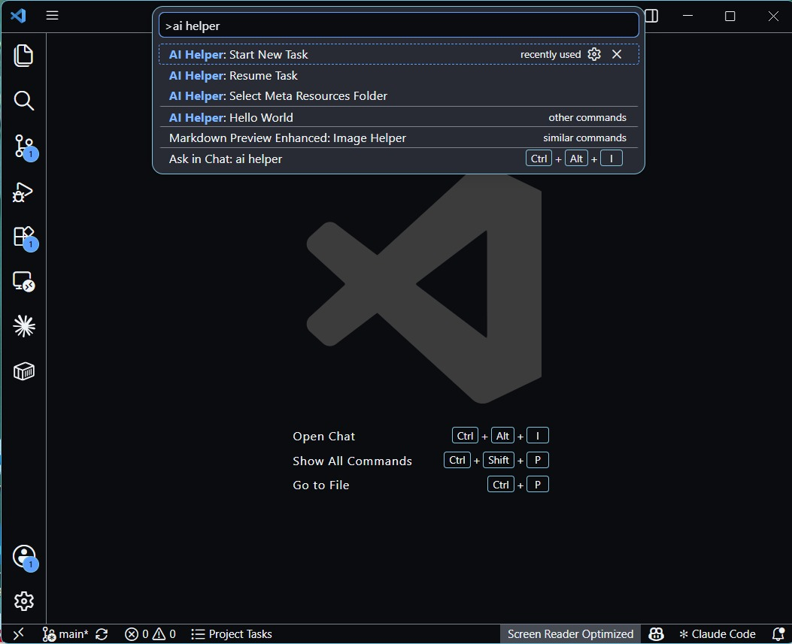
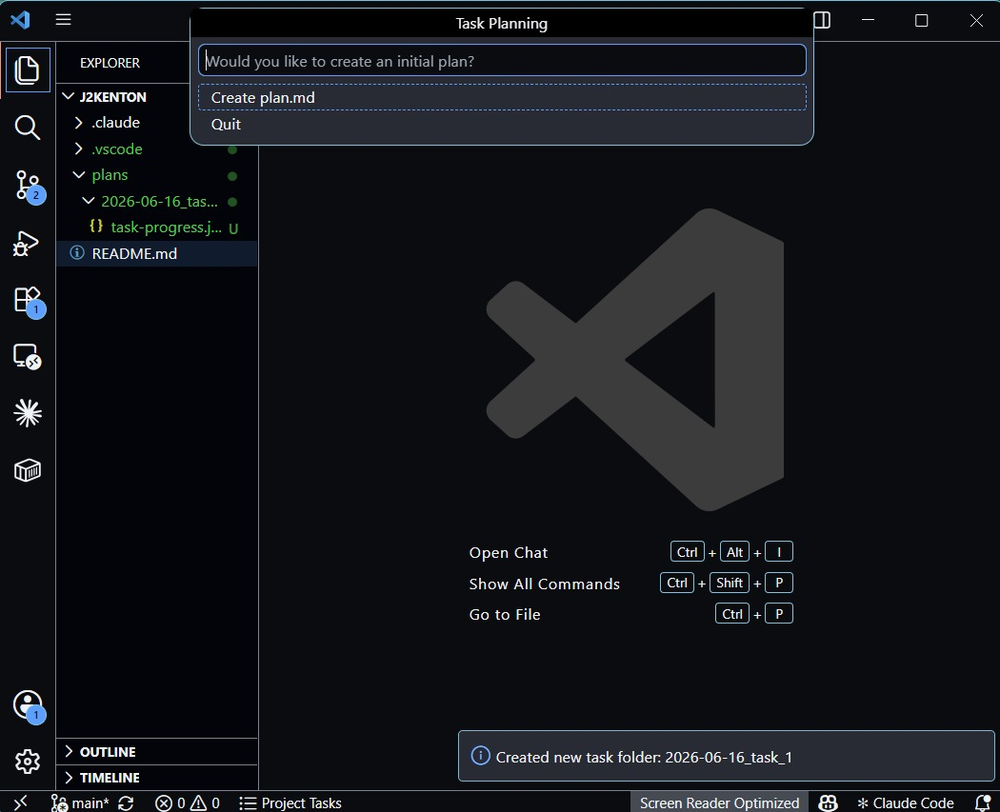

# VS Code AI Helper

VS Code AI Helper turns ad-hoc "let's plan this out" conversations into a repeatable, file-based workflow. Every task gets its own dated folder and moves through a fixed pipeline — task description, plan, high- and low-level plan reviews, final plan, implementation checklist, and high- and low-level implementation reviews — with every artifact written by hand or generated with your existing GitHub Copilot subscription, no API key required.

The pipeline:

```text
Task Created → Plan → Plan: High-Level Review → Plan: Low-Level Review
→ Final Plan → Implementation → Impl: High-Level Review → Impl: Low-Level Review → Completed
```

There is one plan file (`plan.md`) that gets revised **in place** when you apply a review — no forked "updated plan" copies to keep track of. Implementation reviews send the files changed during the AI implementation run to Copilot along with the final plan, so the AI assesses what's *actually implemented* versus outstanding. If a changed file is open in the editor with unsaved edits, the unsaved buffer is used instead of the on-disk copy. Tasks implemented manually (or before file tracking was introduced) fall back to open editors with an explicit warning.

## Marketplace

Install from the Visual Studio Marketplace:

<https://marketplace.visualstudio.com/items?itemName=j2kenton.vs-code-ai-helper>

## Requirements

- VS Code 1.93.0 or higher
- A workspace folder open (the extension stores everything relative to your workspace)
- Optional: an active GitHub Copilot subscription, signed in to VS Code, if you want to use the "with AI" commands

## Quick Start

1. **Point the extension at a folder.** Run `AI Helper: Select Meta Resources Folder` from the Command Palette (`Ctrl+Shift+P` / `Cmd+Shift+P`) and choose a folder inside your workspace (e.g. `.ai-helper/` or `docs/tasks/`). This is where all task folders will be created.
2. **Start a task.** Run `AI Helper: Start New Task`. This creates a folder named `YYYY-MM-DD_task_N` (numbered per day) and opens `task.md` for you to describe what you want done — the goal, scope, and any constraints.
3. **Get a plan.** Either write `plan.md` yourself, or run `AI Helper: Generate Plan with AI` to have Copilot draft it from your `task.md` and currently open editors in the workspace.
4. **High-level review.** Run `AI Helper: Run Review with AI` (or write `plan-high-review.md` yourself) to critique the plan's overall approach and scope. While on a review stage you have four actions — in the Tasks view they're buttons on the task row:
   - **View Review** — open the review file.
   - **Reply to Review** — open a `-reply.md` file where you push back on or clarify review points; it's sent to the AI along with the review.
   - **Apply Review with AI** — Copilot rewrites `plan.md` in place, addressing the review (and your reply, if any). Re-run the review afterwards if you want another pass.
   - **Next Stage** — happy with the plan? Move on.
5. **Low-level review.** Same actions, but the review (`plan-low-review.md`) critiques the details: step ordering, named files, edge cases, verifiable acceptance criteria.
6. **Finalize.** `Next Stage` from the low-level review offers to promote the current plan to `plan-final.md`. Promoting is always a deliberate, human step — no command auto-approves a plan.
7. **Implement.** Run `AI Helper: Generate Implementation Checklist with AI` to turn `plan-final.md` into `implementation.md` — a concrete `- [ ]` checklist. Do the work.
8. **Implementation reviews.** Run the high-level then low-level implementation reviews: Copilot receives the final plan, the checklist, and the **contents of the files changed during the AI implementation run** (or the currently open editors if the task was implemented manually — the extension will warn you). If a changed file is open with unsaved edits, the unsaved buffer is used in place of the on-disk copy. Files that are too large may be truncated; the context pack notes any truncation or omission explicitly. Apply a review to update the checklist's checkboxes and notes in place. When the low-level review is clean, `Next Stage` marks the task completed.
9. **Come back later.** If you stop partway through (or just close VS Code), run `AI Helper: Resume Task` (or click the task in the Tasks view) — it shows the actions relevant to the task's current stage, using `task-progress.json` to know where you are.

Tasks created with versions before 0.6.0 still work: old stage names are migrated automatically, and a legacy `plan-updated.md` is treated as the current plan until the first in-place update writes `plan.md`.

Everything the extension writes is a plain Markdown or JSON file in your task folder, so you can read, edit, or hand it to a different tool at any point — nothing is locked into the extension.

## Tasks View

Click the AI Helper icon in the Activity Bar to open the **Tasks** view — a persistent, always-up-to-date checklist of where every task stands, so you don't have to re-run a command just to check progress:

- Each task shows its current stage and step count (e.g. `Plan: High-Level Review · step 3 of 9`) directly in the tree.
- Expand a task to see all 9 workflow stages, each marked done ✓, current →, or outstanding ○. Click a stage to open its artifact file directly (if it's been created).
- The most recently updated active task auto-expands so you land on the relevant checklist immediately.
- Inline buttons let you **Resume** or **Set Stage** for a task without leaving the view. On review stages, the task row (and the current stage row) instead show the review actions: **View**, **Reply**, **Apply**, and **Next Stage** (with **Run Review with AI** in the right-click menu).
- The view refreshes automatically whenever a task's `task-progress.json` changes — no manual refresh needed (though a refresh button is there too).

A matching status bar item (bottom-left) always shows your most recently active task and its stage, and jumps into `Resume Task` when clicked — so progress is visible even with the sidebar closed.

## Commands

| Command | What it does |
| --- | --- |
| `AI Helper: Select Meta Resources Folder` | Choose where task folders are stored for this workspace. Run this once per workspace before anything else. |
| `AI Helper: Start New Task` | Creates a new `YYYY-MM-DD_task_N` folder with progress tracking and opens `task.md`. From there, use the Tasks view or `Resume Task` for the per-stage actions. |
| `AI Helper: Resume Task` | Shows the actions relevant to a task's current stage — open the artifact, run/apply reviews, advance — instead of a forced wizard. |
| `AI Helper: Generate Plan with AI` | Uses your Copilot access to draft `plan.md` from `task.md` and a generated `context-pack.md`. Only offered before later-stage work exists, so it can't clobber it. |
| `AI Helper: Run Review with AI` | Runs the review for wherever the task is: from `plan`/`implementation` it starts the high-level review (and advances the stage); from a review stage it (re)generates that stage's review. Implementation reviews use the files changed during the AI implementation run as the review scope; if no tracked file set exists (manual implementation), they fall back to open editors with a warning. |
| `AI Helper: View Review` | Opens the current stage's review file; offers to run the review if it doesn't exist yet. |
| `AI Helper: Reply to Review` | Opens a `-reply.md` file for the current review where you push back or clarify; it's sent to the AI when you Apply. |
| `AI Helper: Apply Review with AI` | Copilot rewrites the plan (plan reviews) or the implementation checklist (implementation reviews) **in place**, addressing the review and your reply. Asks for confirmation first. |
| `AI Helper: Next Stage` | Advances the task one stage, with confirmation. Entering Final Plan offers to promote the current plan to `plan-final.md`; entering Completed asks explicitly. |
| `AI Helper: Generate Implementation Checklist with AI` | Turns `plan-final.md` into `implementation.md`, a concrete `- [ ]` checklist with a Verification section. |
| `AI Helper: Set Task Stage` | Manually set which stage a task is tracked at, moving it backward or forward. Only changes `task-progress.json` — it doesn't touch or delete any artifact files. |
| `AI Helper: Refresh Tasks View` | Manually refresh the Tasks sidebar (it also refreshes automatically on its own). |
| `AI Helper: Hello World` | Sanity-check command confirming the extension is active. |

Every "with AI" command asks for confirmation before overwriting an existing artifact, is only offered when the task is at a stage the action applies to, and falls back with a clear message (no crash, no silent failure) if Copilot isn't signed in, has no available model, or you're out of quota. Every AI action has a manual counterpart — the workflow never requires Copilot. Promoting a plan to `plan-final.md` and marking a task completed are intentionally explicit, human steps.

## What gets created in a task folder

```text
YYYY-MM-DD_task_N/
├── task-progress.json         # Machine-readable stage tracker
├── task.md                    # Your request: goal, scope, constraints
├── context-pack.md            # Auto-generated snapshot sent to Copilot (uses tracked changed files for impl reviews; open editors as fallback)
├── plan.md                    # THE plan — revised in place when reviews are applied
├── plan-high-review.md        # High-level review of the plan (+ optional -reply.md)
├── plan-low-review.md         # Low-level review of the plan (+ optional -reply.md)
├── plan-final.md              # The approved plan (human-promoted)
├── implementation.md          # Checklist derived from the final plan, checked off as reviews confirm items
├── impl-high-review.md        # High-level implementation review (+ optional -reply.md)
├── impl-low-review.md         # Low-level implementation review (+ optional -reply.md)
└── runs/
    └── 001-copilot-lm-plan.md # Log of each AI run: prompt sent + result
```

`runs/` gives you a paper trail of exactly what was asked and what came back each time you use an AI command, separate from the artifact itself.

## Settings

| Setting | Description |
| --- | --- |
| `vs-code-ai-helper.metaResourcesPath` | Workspace-relative path where task folders are stored. Set via `AI Helper: Select Meta Resources Folder`. |
| `vs-code-ai-helper.promptDismissed` | When `true`, suppresses the one-time activation prompt asking you to configure a folder. |

## Screenshots

| Command Palette | Task Planning |
| --- | --- |
|  |  |

## Development

### Setup

```bash
# Install dependencies
pnpm install

# Compile the extension
pnpm run compile
```

### Running the Extension

1. Press `F5` to open a new VS Code window (the "Extension Development Host") with the extension loaded
2. Open a folder as your workspace in that window
3. Run `AI Helper: Select Meta Resources Folder`, then `AI Helper: Start New Task` from the Command Palette (`Ctrl+Shift+P`) to exercise the full workflow described in [Quick Start](#quick-start)

### Available Scripts

| Script | Description |
|--------|-------------|
| `pnpm run compile` | Compile the extension |
| `pnpm run watch` | Watch for changes and recompile |
| `pnpm run package` | Package the extension for production |
| `pnpm run lint` | Run ESLint |
| `pnpm run lint:fix` | Run ESLint with auto-fix |
| `pnpm run test` | Run tests |

## Project Structure

```
vs-code-ai-helper/
├── .vscode/                     # VS Code configuration
│   ├── launch.json              # Debug configurations
│   └── tasks.json               # Build tasks
├── resources/
│   └── prompts/                 # Prompt templates used by the AI commands
├── src/
│   ├── extension.ts             # Extension entry point / command registration
│   ├── commands/                # One file per command (startNewTask, resumeTask, generatePlanWithAI, ...)
│   ├── runners/                 # AI provider adapters (currently: Copilot Language Model API)
│   ├── config/                  # Workspace settings helpers
│   ├── types/                   # Shared types (TaskProgress, AgentRunner, ...)
│   └── utils/                   # Task-progress, context-pack, and run-log helpers
├── dist/                        # Compiled output (git-ignored)
├── package.json                 # Extension manifest
├── tsconfig.json                # TypeScript configuration
├── .eslintrc.json               # ESLint configuration
└── esbuild.js                   # Build configuration
```

## License

MIT
