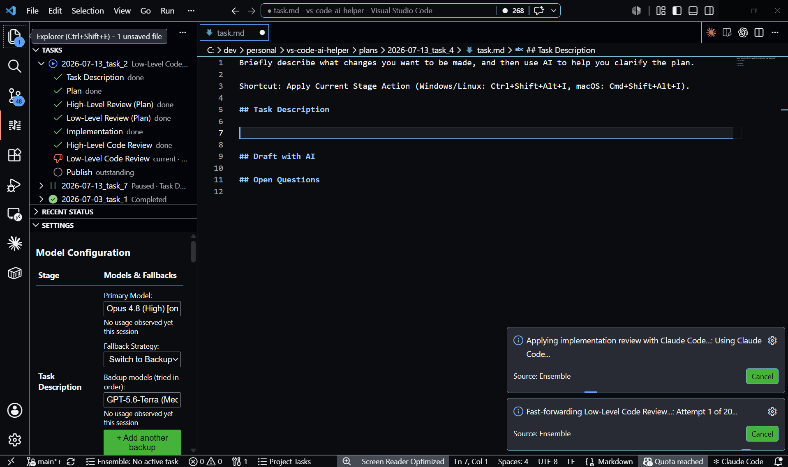
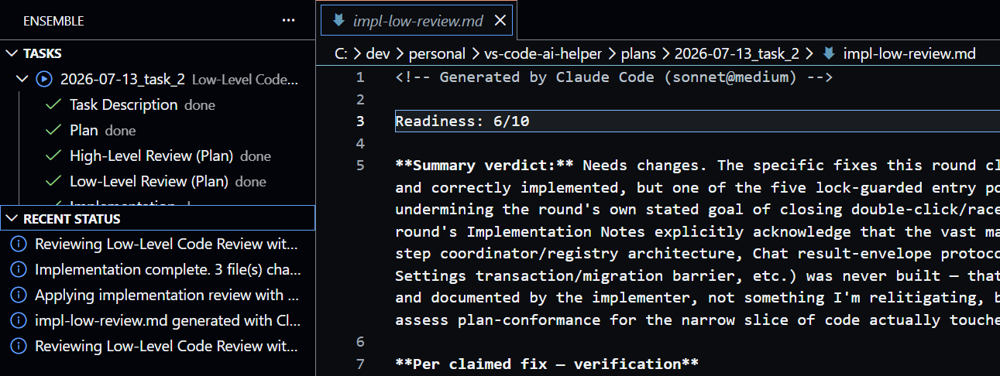
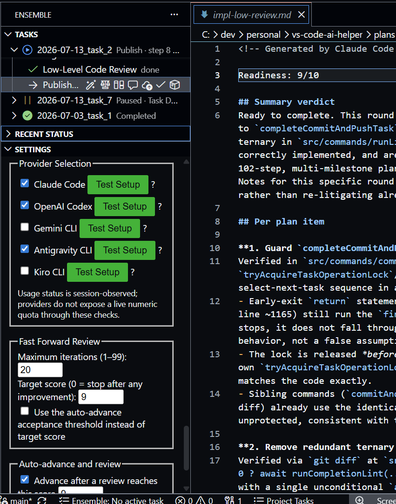
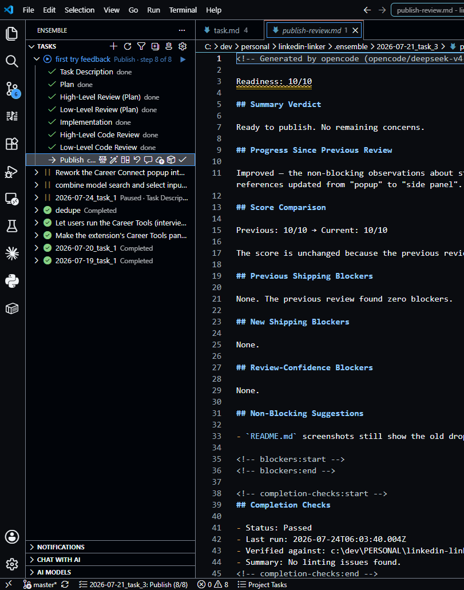

# Ensemble: Supervised AI Workflow for VS Code

[](https://marketplace.visualstudio.com/items?itemName=j2kenton.vs-code-ai-helper)
[](https://marketplace.visualstudio.com/items?itemName=j2kenton.vs-code-ai-helper)
[](LICENSE)

**Turn an idea into a reviewed, supervised implementation: task, plan, implement, review, publish. You pick the AI provider and approve every stage change.**

Ensemble is deterministic AI orchestration for VS Code, not an autonomous agent loop. You stay in control of every stage transition; the AI never decides what happens next.

## Why Ensemble

- **Deterministic stage control.** The workflow moves only when you move it (or when you have explicitly opted in to Auto Advance or Fast Forward).
- **A manual counterpart for every AI action.** Anything the AI can do, you can do by hand.
- **One workflow, many providers.** GitHub Copilot plus nine supported CLI integrations behind one interface.
- **Per-stage model choice with backup chains.** Use a different model for planning, implementation and review, and fall back to another provider if one hits a limit.
- **Plain artifacts.** Tasks, plans and reviews are ordinary Markdown and JSON files you can edit, diff and use with other tools.

## The workflow

The task → plan → implementation → review → publish loop keeps human judgment in the driver’s seat:

1. **Task:** describe the goal, scope, constraints, and acceptance criteria in `task.md`. Write it yourself or generate a first draft with **Draft with AI**.
2. **Plan:** draft or edit `plan.md`, then run the **high-level** and **low-level** plan reviews to improve it. Each review scores the plan's readiness and lists blockers; apply the fixes and re-review until it holds up.
3. **Implementation:** the implementation stage works from the plan (captured in `plan-final.md`) and carries out the changes. AI implementation runs edit workspace files, so supervise and inspect every change. The **high-level** and **low-level** code reviews then check the result the same way the plan reviews checked the plan.
4. **Publish:** run lint, tests, and any configured verification checks, inspect the accumulated diff, and finish the task: commit and push, cut a release, or mark it complete.

The Tasks view and status bar show the current task and stage. Every AI action has a manual counterpart, and task artifacts remain ordinary Markdown and JSON files that you can edit, inspect, or use with another tool.

### Optional: hands-off iteration

Reviews score each stage out of 10, and Ensemble can drive the loop for you. **Fast Forward** repeatedly reviews and applies fixes until it reaches a target score, and **Auto Advance** moves a stage on once its review clears a threshold. Both are off by default and configurable in Ensemble's settings; because implementation and Fast Forward runs change real files, use them only under supervision.

## Screenshots









## Quick start

**Requirements:** VS Code 1.93 or later and an AI provider. GitHub Copilot is built into VS Code and needs no extra install; every CLI provider is optional and off by default.

1. Install from the [Visual Studio Marketplace](https://marketplace.visualstudio.com/items?itemName=j2kenton.vs-code-ai-helper).
2. Open a workspace folder. Ensemble stores task metadata in `.ensemble` at the workspace root. If you have tasks from an older version in a different folder, run **Ensemble: Move Ensemble Resources to .ensemble** to migrate them.
3. Run **Ensemble: Configure AI Models** and choose a model per stage. Copilot needs no extra setup; to use a CLI provider, install and sign in to it first (see [AI providers](#ai-providers)), then enable it here.
4. Run **Ensemble: Start New Task [Ctrl+Shift+O]** (Cmd+Shift+O on macOS) and accept the consent notice that appears before the first AI action in a workspace.
5. Describe the work in `task.md`, then use **Generate Plan** or write the plan yourself. Run the plan reviews, implement, run the code reviews, and use the Publish stage to verify, commit and complete the task.

**Worked example.** Task: "Add a `--version` flag to `tools/cli.js` that prints the version from `package.json`." Generate a plan, run the high-level and low-level plan reviews and apply their fixes, run the implementation, inspect the diff, run the code reviews, then at Publish run your tests and **Commit and Push**.

## AI providers

Ensemble supports GitHub Copilot and nine CLI integrations. A provider is supported in 1.0 only if it is in this table. Install steps, sign-in methods, plans and pricing are set by each vendor and change often; check the linked vendor pages for current details. Ensemble quotes no prices.

| Provider | Install | Sign-in / credentials | Billing | Docs |
|---|---|---|---|---|
| **GitHub Copilot** | Built into VS Code | Sign in with GitHub from the Copilot status-bar icon. With no Copilot plan, signing in gives you Copilot Free | Requests count against your Copilot plan's limits; see [GitHub's plans](https://github.com/features/copilot/plans) | [Setup](https://code.visualstudio.com/docs/copilot/setup) |
| **Claude Code** | Native installer (below) or `npm install -g @anthropic-ai/claude-code` | Run `claude` and follow the browser sign-in, or set `ANTHROPIC_API_KEY` | Included in Pro, Max, Team and Enterprise, or via a Console (API) account; not in the free claude.ai plan. See [pricing](https://claude.com/pricing) | [Setup](https://code.claude.com/docs/en/setup) |
| **OpenAI Codex** | `npm install -g @openai/codex`, or Homebrew, or the installer script (below) | `codex login` (Sign in with ChatGPT) or an API key | Included in ChatGPT plans; API usage billed separately. See [pricing](https://developers.openai.com/codex/pricing) | [Codex CLI](https://github.com/openai/codex) |
| **Gemini CLI** | `npm install -g @google/gemini-cli` | Run `gemini` and sign in, or set `GEMINI_API_KEY` | **Gemini CLI was replaced by Antigravity CLI on 18 June 2026.** Free individual Google accounts can no longer use it; Google AI Pro/Ultra, a Gemini API key, Vertex AI and Code Assist Standard/Enterprise still work. Free users should use Antigravity CLI. See [quota and pricing](https://geminicli.com/docs/resources/quota-and-pricing/) | [Gemini CLI](https://github.com/google-gemini/gemini-cli) |
| **Antigravity CLI** | Installer (below); installs `agy` to `~/.local/bin` | Run `agy` (browser sign-in), or set `GEMINI_API_KEY` | Free Individual plan; Google AI Pro/Ultra raise limits. Check the [pricing page](https://antigravity.google/pricing) for current limits | [Install](https://antigravity.google/docs/cli/install/) |
| **Kiro CLI** | Installer (below) | `kiro-cli login` and a `KIRO_API_KEY` environment variable, because Ensemble runs Kiro headlessly (`chat --no-interactive`) | Kiro plans (Free, Pro, Pro+, Pro Max, Power); API keys are available only on Pro and above. See [pricing](https://kiro.dev/pricing/) | [CLI](https://kiro.dev/cli/), [headless mode](https://kiro.dev/docs/cli/headless/) |
| **OpenCode Zen / Go** | Installer (below) or `npm install -g opencode-ai` | Run `opencode`, type `/connect`, choose Zen or Go and paste the API key from the OpenCode console | Zen: pay-as-you-go credits ([Zen](https://opencode.ai/docs/zen/)). Go: monthly subscription ([Go](https://opencode.ai/docs/go/)) | [OpenCode docs](https://opencode.ai/docs/) |
| **Cline CLI** | `npm install -g cline` (Node 20+) | `cline auth`, then choose ClinePass | ClinePass subscription only (Ensemble always passes `-P cline-pass`). See [ClinePass](https://cline.bot/cline-pass) | [Installation](https://docs.cline.bot/cline-cli/installation), [authorizing](https://docs.cline.bot/getting-started/authorizing-with-cline) |
| **Kimi Code CLI** | Official installer only (below) | `kimi login` | Kimi membership, or a Kimi Platform pay-as-you-go API key. See [membership](https://www.kimi.com/en/help/membership/membership-overview) | [Getting started](https://www.kimi.com/code/docs/en/kimi-code-cli/guides/getting-started) |
| **devpass-code** | `npm i -g devpass-code` | `devpass-code auth login`, then choose "LLM Gateway DevPass" | DevPass monthly subscription. See [DevPass](https://devpass.llmgateway.io/) | [GitHub](https://github.com/theopenco/devpass-code), [guide](https://docs.llmgateway.io/guides/devpass-code) |

Installer commands (macOS/Linux unless noted):

```bash
# Claude Code (Windows PowerShell: irm https://claude.ai/install.ps1 | iex)
curl -fsSL https://claude.ai/install.sh | bash

# OpenAI Codex (alternative to npm)
curl -fsSL https://chatgpt.com/codex/install.sh | sh

# Antigravity CLI (Windows PowerShell: irm https://antigravity.google/cli/install.ps1 | iex)
curl -fsSL https://antigravity.google/cli/install.sh | bash

# Kiro CLI
curl -fsSL https://cli.kiro.dev/install | bash

# OpenCode
curl -fsSL https://opencode.ai/install | bash

# Kimi Code CLI (Windows PowerShell: irm https://code.kimi.com/kimi-code/install.ps1 | iex)
curl -fsSL https://code.kimi.com/kimi-code/install.sh | bash
```

OpenCode appears as two separate provider rows in Ensemble: **OpenCode Zen** for `opencode/...` models and **OpenCode Go** for `opencode-go/...` models. They use the same `opencode` CLI and can use the same OpenCode key, but enabling or connecting one does not grant access to the other. A Zen/Go backup is only used when you explicitly select it as a backup model. devpass-code is a fork of OpenCode with its own single "LLM Gateway DevPass" account, so it appears as one provider row.

Enable the CLI providers you want under **Ensemble: Configure AI Models**. AI actions consume real quota or money, and implementation runs modify workspace files.

### Provider safety notes

Providers differ in how much they restrict plan and review runs. Ensemble passes the following permission settings:

| Provider | Implementation runs | Plan/review runs |
|---|---|---|
| GitHub Copilot | VS Code Language Model API with file tools | VS Code Language Model API with file tools |
| Claude Code | `--permission-mode acceptEdits` | `--permission-mode plan` |
| OpenAI Codex | `--sandbox workspace-write` | `--sandbox read-only` |
| Gemini CLI | `--approval-mode auto_edit` | No write tools |
| Kiro CLI | `--trust-all-tools` | `--trust-tools fs_read,grep,glob` |
| OpenCode, devpass-code | `--agent build` | `--agent plan` |
| Antigravity CLI | `--dangerously-skip-permissions` | `--dangerously-skip-permissions` |
| Cline CLI | `--auto-approve true` | `--plan` (shell still auto-approved) |
| Kimi Code CLI | No permission flag | No permission flag |

> **Note on Antigravity:** it runs with `--dangerously-skip-permissions` in **every** mode, including plan and review, so it can create, change, or delete any file in your workspace without asking, even on a run you'd expect to be read-only. Its headless CLI offers no scoped read-only mode, and without the flag its runs fail having done nothing. Commit or back up before using it, or pick another provider.

> **Note on Cline:** its headless CLI has no scoped read-only mode. Plan/review runs pass `--plan`, but that only changes the model's own system-prompt instructions; its shell-command tool stays available and auto-approved, so a plan/review run can still create, change, or delete files if a prompt causes it to. Implementation runs use `--auto-approve true`. Turning auto-approval off is not a safer option: it blocks every tool, including file reads, because headless mode cannot grant interactive approval. Commit or back up before using it.

> **Note on Kimi Code CLI:** Kimi's `-p` (one-shot prompt) flag rejects `--plan`, `--yolo` and `--auto`, so **no mode passes any permission flag**; implementation and plan/review runs use identical arguments, and a run with no flags can write files and run shell commands without an approval prompt. Kimi accepts a prompt only as a command-line argument, so Ensemble writes the full prompt to a temp file and passes Kimi a short instruction to read it. That requires launching the real binary, so install Kimi with the **official installer**, not npm. Commit or back up before using it.

### Choosing models and effort tiers per stage

A model's **effort tier** (Low/High/Max, etc.) tends to matter more for review quality than which model you pick. General guidance, not a measured result:

- **Avoid running Publish below a high effort tier.** At this stage the tier matters more than the specific model.
- **Avoid assigning a free or daily-limited model to Implementation.** A quota exhaustion mid-implementation can leave a half-written tree.
- **Prefer Claude Code or Codex CLI for Implementation.** Implementation runs are long, stateful and write files, so a provider that stops safely on a quota limit matters most there.
- **Treat OpenCode as acceptable for reviews** (short, read-only, cheap to redo) but be cautious using it for Implementation.
- **Cross provider boundaries in your backup chain.** If a stage's backup is on the same account as its primary (Ensemble warns about this in **Configure AI Models** when Fallback Strategy is set to Switch to Backup), a session limit on the primary will hit the backup identically.

## Configuration

Settings live under `ensemble.*` in VS Code Settings. The most useful ones:

| Setting | Default | What it does |
|---|---|---|
| `ensemble.modelSettings` | `{}` | Per-stage primary model, ordered backups and fallback strategy. Edited through **Configure AI Models**. |
| `ensemble.enabledProviders` | `{}` | Which providers are enabled. |
| `ensemble.autoAdvanceEnabled` | `"off"` | Move a stage on automatically when its review meets the score threshold. |
| `ensemble.autoAdvanceScoreThreshold` | `10` | Review score (1-10) required for Auto Advance. |
| `ensemble.fastForwardMaxIterations` | `5` | Maximum rounds for one Fast Forward run (1-99). |
| `ensemble.maxImplementationIterations` | `200` | Maximum implementation tool-call rounds (1-200). |
| `ensemble.publishVerificationCommands` | `[]` | Explicit commands to run as Publish verification. |
| `ensemble.allowDirtyWorktreeChanges` | `false` | Allow AI changes alongside unrelated uncommitted changes. |
| `ensemble.desktopNotifications` | `false` | Show native notifications when Ensemble needs your attention. |

- `vs-code-ai-helper.*` settings are legacy aliases from earlier versions.
- `ensemble.hostRole` is experimental and not supported in 1.0.
- `ensemble.resilience.*` options are available in the Settings UI.

## Troubleshooting

- **CLI not found.** The CLI must be on the `PATH` VS Code sees. Installers often add `~/.local/bin` (for example `agy`); restart VS Code after installing.
- **Sign-in errors.** Kiro needs `KIRO_API_KEY` as well as `kiro-cli login`. OpenCode Zen and Go are separate services: connect the one you selected. Gemini CLI no longer works with a free personal Google account; use Antigravity CLI.
- **Kimi fails to start.** If you installed it with npm, reinstall with the official installer.
- **A run stops on a quota or session limit.** Add a backup model on a different provider account in **Configure AI Models**.
- **Where are the logs?** Run logs are in the `runs/` folder inside the task folder under `.ensemble`.
- **Found a bug?** Open a [GitHub issue](https://github.com/j2kenton/vs-code-ai-helper/issues).

## How it's built

- A TypeScript extension for VS Code ^1.93, bundled by esbuild into a single file. No third-party runtime code is bundled.
- One provider abstraction (`src/runners/providers.ts`, `src/runners/runnerRegistry.ts`) with per-mode permission flags and backup routing.
- A framed, schema-checked AI result contract (`src/prompts/aiResultContractV1.ts`, `src/types/aiResultEnvelope.ts`).
- A bounded watchdog on every provider call.
- Context-pack limits: at most 20 files, 100,000 bytes per file and 400,000 bytes in total, with a secret-filename denylist (for example `.env` files). The denylist matches filenames only; it is not secret detection.
- A versioned consent gate (`src/legal/disclaimerVersion.ts`, `src/utils/aiConsent.ts`).
- An extensive unit-test suite (`pnpm run test:unit`).

## Safety and disclaimer

This extension is provided as-is with no warranty. Read [`DISCLAIMER.md`](DISCLAIMER.md) in full before use; it is the canonical document. AI runs send eligible open-editor contents to the selected third-party provider and may create, overwrite, or delete workspace files. Always commit or back up first, supervise every run, and review generated changes. See [`SECURITY.md`](SECURITY.md) for vulnerability reporting.

### Privacy

- **What leaves your machine:** prompts and context-pack contents go to the provider you select, through VS Code's Language Model API (Copilot) or through that provider's own CLI. Provider CLIs can also read (and, depending on the permissions in the table above, edit) other files in your workspace through their own tools; anything a CLI reads may be sent to that provider. Provider CLIs may contact their vendor to refresh model lists or check sign-in. Publish can run `git push` to the remote you have configured, and runs any verification commands you configure. Links you click (sign-in, usage) open in your browser.
- **What stays local:** task artifacts and run logs in `.ensemble/`, and extension state in VS Code storage.
- **Publish and `.ensemble`:** if `.ensemble` is not git-ignored in your repository, Publish can commit and push task artifacts such as `task.md`, plans and reviews. By default Publish stages only changes outside the task folder. If the only changes are inside it, Publish asks before including them. Chat transcripts are never staged. Run logs (`runs/`), `context-pack.md` and `pr-description.md` are not staged by Publish itself unless you explicitly choose **Include Run Artifacts** in a prompt; they contain full AI prompts and file excerpts. Files you have already staged in git yourself are committed as staged, so unstage any run logs or context packs before you publish.
- Ensemble itself sends no telemetry or usage data. Data sent to Copilot or a vendor CLI is governed by that provider.

### Third-party services

Each provider's terms, pricing, usage policies and data handling apply to your use of it. You are responsible for using your accounts within those terms. Ensemble does not make compliance claims on your behalf.

### Trademarks

Ensemble is an independent project and is not affiliated with or endorsed by any of the following. GitHub Copilot, Claude and Claude Code, OpenAI Codex, Gemini, Antigravity, Kiro, OpenCode, Cline, Kimi, devpass-code, LLM Gateway and Visual Studio Code are names or trademarks of their respective owners, used only to identify compatible products.

## Project links and maintenance

- [Changelog](CHANGELOG.md)
- [Contributing](https://github.com/j2kenton/vs-code-ai-helper/blob/main/CONTRIBUTING.md)
- [Security policy](SECURITY.md)
- [Issues](https://github.com/j2kenton/vs-code-ai-helper/issues)
- [Disclaimer](DISCLAIMER.md)
- [License](LICENSE)

Maintained by [Jonathan Kenton](https://github.com/j2kenton); issues are triaged on a best-effort basis.

## Development

```bash
pnpm install
pnpm run compile
pnpm run test:unit
```

Press `F5` to launch an Extension Development Host. Run `pnpm run lint` for linting and `pnpm run vsix` to build a VSIX.

## License

MIT, Copyright (c) 2025 Jonathan Kenton. See [LICENSE](LICENSE). No third-party runtime code is bundled.
